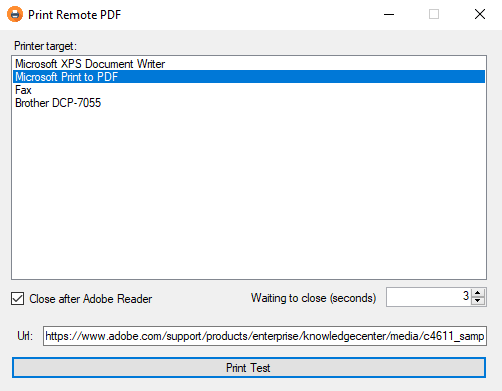

# localPrintService

Application that through a web link to a pdf, allows you to previously select the printer and automatically print the document.

Ideal for setting up a local invoice reception service, or any other PDF document received periodically.

## Use 

Visual Studio 2015 and windor forms and C#
